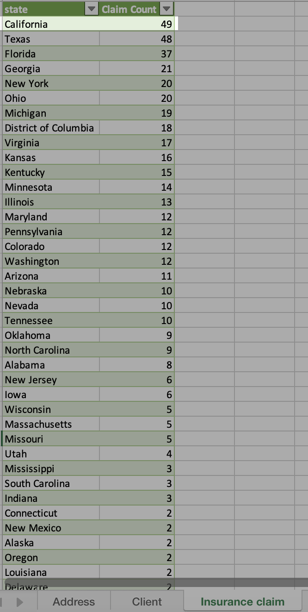

# Virtual Machine (VM) Exercises

## :information_source: Read this before getting started
- The two exercises should not replicate the exact actions shown in your screencast. The goal of exercises is for learners to apply what was learned in the screencasts to new problems or situations. This is best pedagogical practice for retaining and building skills. For example, this can be done by using another dataset between screencasts and exercises or focusing on a different portion of the dataset.
- Power BI / Tableau specific: We can only run free versions of BI software in our virtual machine exercises. In the case of Power BI, make sure the exercises can run on [Power BI Desktop](https://powerbi.microsoft.com/en-us/desktop/) without any additional paid products. 
- Unsure what the scope of an exercise should be? Here's an [example](https://campus.datacamp.com/courses/introduction-to-power-bi/getting-started-with-power-bi?ex=14) from Introduction to Power BI. The first chapter of most DataCamp courses are free, so take a look at our [BI courses](https://learn.datacamp.com/courses?technologies=Tableau&technologies=Power%20BI) to get a feel for how we assess and guide learners.

## 1st VM Exercise

#### Dataset

- [ ] Add datasets used to the `datasets/` folder

#### Files

- [ ] **Initial**: Add file to the `exercises/`  folder with the name `ex-1-intial.twbx` or `ex-1-intial.pbix` or `ex-1-initial.yxmd`, depending if you are auditioning for a Tableau/Power BI/Alteryx course.
- [ ] **Solution**: Add file to the `exercises/`  folder with the name `ex-1-sol.twbx` or `ex-1-sol.pbix` or `ex-1-sol.yxmd`

#### Learning Objective

*The exercise assesses the learner’s ability to successfully apply right anti join in power query*

#### Context

**Customers affected due to data loss**

*Your boss just informed you that some claim records were accidentally erased during migration of data to cloud. As a result, there is a risk of complaints from customers if their claims were not addressed on time. Hence, you need to quickly update your boss which customers are impacted and how many of them in total. This will allow him to check in with these affected customers and ensure their needs are met.*

#### Steps to be executed by the student (max 6)

*Each bulleted instruction is a set of complete sentences that describe a specific task.*

- Step 1: 
    * Keep only `Client_ID` from `Insurance claim` & only `Client_ID`, `first_name`, `last_name` from `Client`.
    * Ensure the Insurance Claim is selected for merge operations in the subsequent step.
- Step 2: 
    * Select Combine > Merge queries.
    * For Right table for merge*, choose `Client`.
    * Then, select `Client_ID` in both `Insurance claim` and `Client`.
    * For Join kind*, choose Right anti and then, OK.
- Step 3:
    * Ensure all columns selected from `Client` in Step 1 is visible in `Insurance claim`.
    * Click Close & Load.

#### Exercise question:
*Multiple choice question: How many customers are affected by loss of claim records?* 

Options:
1. 232
2. 233 
3. 234
4. 235

*Answer: Option 2. (i.e. 233 customers)*

#### End goal:

**

## 2nd VM Exercise

#### Dataset

- [ ] Add datasets used to the `datasets/` folder

#### Files

- [ ] **Initial**: Add file to the `exercises/`  folder with the name `ex-2-intial.twbx` or `ex-1-initial.yxmd`, depending if you are auditioning for a Tableau/Power BI/Alteryx course.
- [ ] **Solution**: Add file to the `exercises/`  folder with the name `ex-2-sol.twbx` or `ex-2-sol.pbix` or `ex-1-sol.yxmd`

#### Learning Objective

*The exercise assesses the learner’s ability to successfully apply left join in power query*

#### Context

**Risky states receiving high number of claims**

*The business is becoming increasingly concerned with the rising frequency of claim requests as it risks higher payouts and hence, lower profitability. To better understand the underlying reason behind this trend, you are tasked to identify risky states which are experiencing highest volumes of claim requests with claim request > 1000 USD per claim. This insight will help the business prioritise those states for investigation and manage risks.*

#### Steps to be executed by the student (max 6)

*Each bulleted instruction is a set of complete sentences that describe a specific task.*

- Step 1:
    * Apply filter `Clm Amt` > 1000 in `Insurance claim`.
- Step 2: 
    * Keep only `Claim_ID`, `Client_ID` from `Insurance claim`, only `Client_ID`, `Address_ID` from `Client` and only `Address_ID`, `State` from `Address`.
    * Ensure the `Insurance Claim` is selected for merge operations in the subsequent steps.
- Step 3: 
    * Select Combine > Merge queries.
    * For Right table for merge*, choose `Client`.
    * Then, select `Client_ID` in both `Insurance claim` and `Client`.
    * For Join kind*, choose Left and then, OK.
    * Ensure `Address_ID` from `Client` is visible.
- Step 4: 
    * Select Combine > Merge queries.
    * For Right table for merge*, choose `Address`.
    * Then, select `Address_ID` in both `Client` and `Address`.
    * For Join kind*, choose Left and then, OK.
    * Ensure `State` from `Address` is visible.
- Step 5: 
    * Select `Claim_ID` and `State`. 
    * Select Transform > Group by.
    * Set `State` for Group by, `Claim Count` for New column name*, Count rows for Operations* and then, OK. 
    * Sort `Claim Count` in descending order.
- Step 6:
    * Click Home > Close & Load.

#### Exercise question:
*Open ended question: Which state has the highest claim count and how many claims made in that state? *

*Answer: California, 49*

#### End goal:

**

